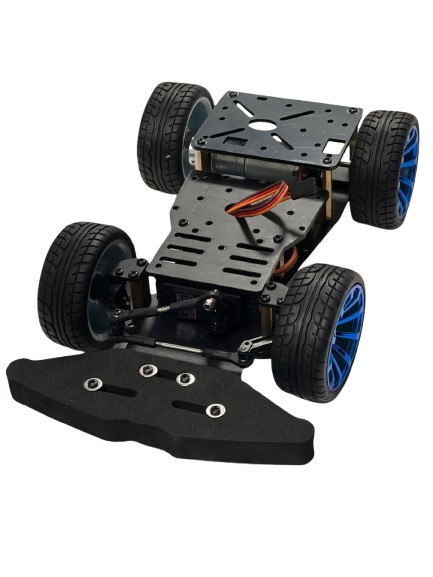

# 📄 Table of contents
### [Our journey](#our-journey)
### [Our plan and Strategy](/our_plan_and_strategy.md)
### [Hardware documentation](/schemes/README.md)
### [Software documentation](/src/README.md)
### [Videos](/video/video.md)
### [Team Photos](/t-photos/)
### [Vehicle Photos](/v-photos/)

## The team
From Palestine, we are CanaaniBots — a team of three passionate young engineers and a supportive coach. After a year of competing together in WRO, trying out categories like Innovators and Future Engineers. This year, we're thrilled to return to the Future Engineers challenge once again!

>Members

- **Sara Abdou** from [Birzeit University](https://www.birzeit.edu/en) - Department of Electrical and Computer Engineering, Birzeit UNI
  - imadsara117@gmail.com
- **Rama Najjar** from [Birzeit University](https://www.birzeit.edu/en) - Department of Mechanical and Mechatronics Engineering, Birzeit UNI
  - ramanajjar25@gmail.com
- **Sadeel Taleeb** from [Birzeit University](https://www.birzeit.edu/en) - Department of Electrical and Computer Engineering, Birzeit UNI
  - sadeeltaleeb4@gmail.com

>Coach

- **Eng. Ahmad AbuBaker** - TA at the Mechanical and Mechatronics Engineering Department, Birzeit UNI,[Birzeit University](https://www.birzeit.edu/en/study/academic-departments/mmed)
  - ahmadabubaker199@gmail.com

## Past experiences
Over the past few years, our team has gained a wide range of skills and hands-on experience through continuous work in robotics projects and challenges. These experiences provided us with a strong foundation that we were able to carry into the Future Engineers category, several of our previous learnings remained valuable, such as:
Familiarity with various sensors, including gyroscope and ultrasonic sensors, as well as car steering mechanisms

  - Programming experience, including building our own frameworks
  - Developing visual debugging systems to test and refine our code
  - Hands-on experience with microcontrollers such as Raspberry Pi and Arduino
  - A solid background in working with different programming languages, sensors, and motors
  - Experience using OpenCV libraries for image processing and computer vision

## What the Robot Taught Us
Designing our robot was more than just building hardware—it was a full-on engineering adventure. Every challenge we faced pushed us to learn new tools, experiment with ideas, and grow as a team. From the first sketch to the final test run, the journey was packed with hands-on learning and exciting discoveries, Here are some of the key skills and experiences we gained:
  - Gained experience in mechanical design (learned how to use SolidWorks to design a functional mechanical differential) and prototyping using 3D modeling tools
  - We learned how to design electronic components using Fritzing
  - Explored and implemented advanced steering and turning systems
  - Integrated and calibrated various sensors to ensure accurate and stable robot behavior
  - Practiced debugging techniques and iterative testing to refine performance
  - Improved teamwork, time management, and project planning through collaboration

## Our first design
At first, our initial design was based on a [pre-made metal frame car](https://technolab.ps/detail/471), which included a metal base plate, two additional smaller base parts, a steering system, and four good-quality wheels. We did not rely on the original frame as it was; the main goal of using it was to speed up the design process. We modified it directly using custom parts that we designed and 3D printed, in order to implement the plan we had in mind more accurately and in a way that meets the project’s requirements.

The design phases of the robot were diverse and multi-staged, involving the design of new parts tailored to each stage of the robot’s mechanical development. The design was not static; it evolved continuously based on the requirements of each phase. We also conducted accuracy tests for the robot at each step, according to the strategy we had previously established, to ensure the desired performance and guide adjustments effectively.

All of these stages and modifications were documented in detail in the Hardware Documentation, serving as a clear and comprehensive reference for our work.

  
  

## The final design

  
## Teamwork
We had weekly meetings with our coach to review our progress and make sure we were heading in the right direction. These sessions were essential for reflecting on what we had accomplished, discussing what needed improvement, and going through our documentation to keep everything organized and clear.

Our work was mainly divided into two main parts: mechanical and programming. Each of us focused more on one area depending on our strengths, but we made it a point to collaborate and support each other in both. If someone working on the mechanical side needed help with code, or someone on the programming side needed input on a physical design element, we’d jump in and figure it out together.

Just like our individual team meetings, these coach sessions helped us stay aligned, keep our momentum, and maintain a strong sense of shared responsibility for the entire project.

 
# Conclusion

# Special thanks
Special thanks to 'Kaksh' for helping us get the components and letting us use the Interface Lab 😊 Your support truly made a difference!
We also extend our heartfelt thanks to Al-Nabali & Al-Faris Co. for their generous financial support and continuous encouragement of our team.

