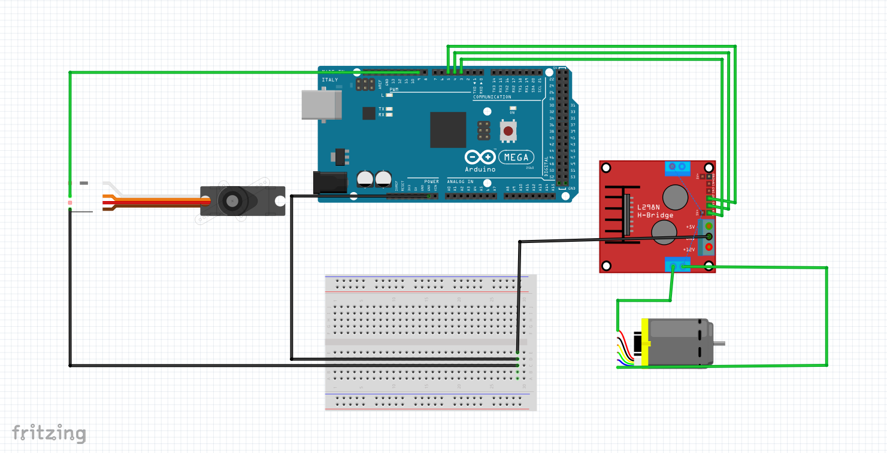
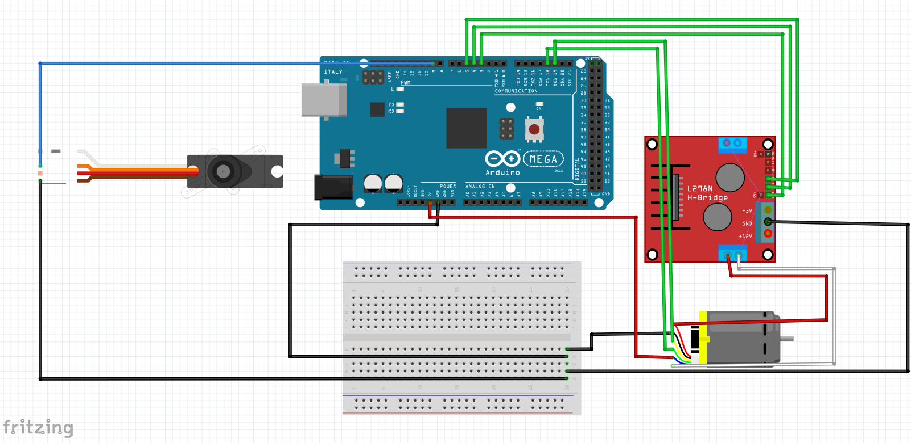
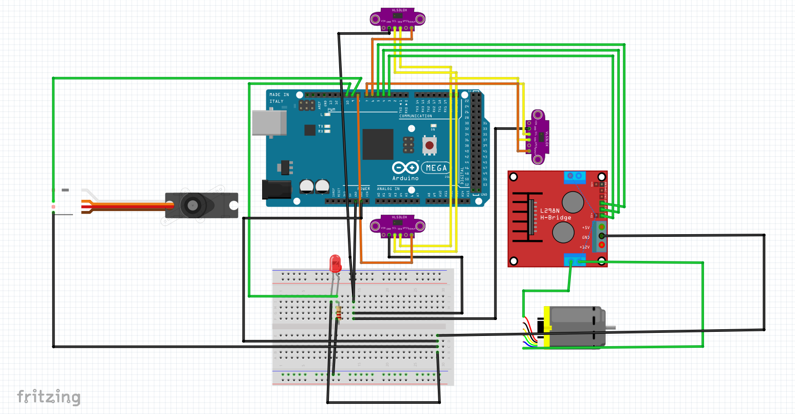

# Hardware documentation 
The robot consists of a wide variety of sensors, motors, and two processing units: a Raspberry Pi 5 and an Arduino Mega. The base is built on a 4WD RC Smart Car Robot Chassis with ann MG996R metal servo and bearing kit, which has been heavily modified to suit our project's requirements. These modifications include custom 3D-printed parts, such as a dedicated camera holder and custom spacers, as well as the replacement of several original components to improve stability, wiring, and sensor integration. All engineering modifications are thoroughly documented and clearly illustrated in the guide provided below.

## List of components
We installed a lot of sensors and other components on the car, here is a list of each of them with a link and some additional notes:
- **Base car** [4WD RC Smart Car Robot Chassis](https://technolab.ps/detail/471)
  - originally 248 x 146 mm, 690 g 695.7 g (including DC and servo motor)
- **Steering servo** [MG996R Metal Servo Bearing Kit](https://technolab.ps/detail/471)
- **DC motor** [DC Gear Motor with Encoder](https://roboticx.ps/product/dc-gear-motor-with-encoder/)
  -  Operating voltage 6V, torque 10 kg*cm max power 3.2A, 210 RPM, 341.2 pulse-per-revolution encoder
- **Single Board Computer** [Raspberry Pi 5 4GB](https://roboticx.ps/product/raspberry-pi-5/?asp_highlight=raspberry&p_asid=3)
  - Operating voltage 5V/5A USB-C, 4 USB ports, 40 pins
- **Microcontroller Arduino Mega 2560** [arduino](https://roboticx.ps/product/arduino-mega-2560-r3-china/)
  - Operating voltage 7-12V, 54 Digital I/O Pins (14 PWM outputs)- 16 Analog Inputs, dimensions: 101.5 x 53.3 mm
- **Motor driver** [L298N](https://roboticx.ps/product/dual-motor-controller-module-l298n/)
  - Max Drive current 2A, control voltage 4.5~5.5V
- **Battery**
  - Bundled with car, 4.2V, 5000mAh,Lithium, [Lithium Ion Battery](https://roboticx.ps/product/lithium-ion-battery-18650-cell-5000mah/)
- **Lithium Battery Charger Module**
  - Maximum current can be 5A , Output voltage 5V
- **Power switch** [SPST](https://roboticx.ps/product/rocker-switch-on-off-spst/)
- **Laser sensor x3** [VL53L0XV2 Laser](https://roboticx.ps/product/vl53l0xv2-laser-ranging-sensor-time-of-flight-tof/)
  - Dimensions 25 x 10 x 4 mm, 50mm – 1.2m range (default mode), 50mm – 2.2m range (long range mode), frequency 5-33 Hz, accuracy ±2cm ,3.3V
- **Camera** [Raspberry Pi Camera Module V2](https://roboticx.ps/product/raspberry-pi-camera-module/?asp_highlight=raspberry&p_asid=3)
  - No built-in color detection algorithm, field of View: 62.2° horizontal 48.8° vertical, up to 90 fps
- **IMU** [GY-BN008X](https://technolab.ps/products?search=bno)
  - Inertial Measurement Unit (IMU) BNO085 – operates at 3.3V with a gyro drift of about 0.5°/min and a dynamic rotation error of approximately 4.5°

## Sensors and motors communication protocols
The different communication protocols used between the components of the robot and their hierarchy:
- Computer
  - Raspberry Pi `SSH & VNC & micro-HDMI `
    - Ardunio Maga `USB `
      - DC Motor with endcoder `Interrupt`
      - Motor driver `PWM` 2x`Digital`
      - Servo `PWM`
      - 3x VL53L0X Sensor `I2C` + `Digital Output (XSHUT)`
  - Camera `CSI-2`

## Design and 3D Printing Of Parts and Assembly Instructions
All parts were specifically designed for the competition using SolidWorks and printed on Qidi i-Fast, Flsun V400, and Flashforge Adventurer 4 Pro printers using a slicer. The files were exported in (.stl) format for 3D printing, and the material used was PLA, The Flashforge Adventurer 4 Pro was mainly used for testing parts, as its print quality was not sufficient for final components. Once the designs were confirmed through testing, the Qidi i-Fast and Flsun V400 were used to print the final parts due to their higher speed and accuracy. You can view the designs of all parts in SLDASM and SLDPRT formats [here](/models/Solid_Works_3D_Drawings),we drilled and adjusted all the parts ourselves in the engineering workshops at the university.

### 1. Level one: Initial Kit-Based Structure and Custom Stage Planning
We started the mechanical build using individual parts from a kit, which included a steering system, a servo motor, and a DC motor. These components were assembled to create a basic driving platform suitable for the project’s initial requirements. Only the first stage of the kit was used, as it provided the base needed for steering and driving tests. The second stage was excluded. 

After initial assembly and testing, we decided to design a complete custom robot structure that better fit the competition dimensions and the hardware requirements. The first concept design was sketched directly on a photo of the assembled parts to visualize the planned structure. The design features a three-stage stacked layout, with all stages planned for 3D printing and optimized for height and component placement.

The first stage, reused from the kit, holds the servo motor and steering system at the front and the DC motor at the rear. The battery pack was placed in the center of this stage to keep the center of mass low, which improves traction between the wheels and the mat and increases stability during movement. This decision was based on advice from our coach, who recommended placing heavier components closer to the ground.

The second stage is designed to hold the Arduino Mega, the motor driver, and three distance sensors — one at the front, one on the left, and one on the right. The sketch originally labeled these as ultrasonic sensors, but they were later replaced with laser sensors after design finalization. This stage also includes space for organized cable routing and clean sensor alignment.

The third stage is reserved for the Raspberry Pi, which was placed at the top of the robot due to its higher heat output compared to the other components. Positioning it on the upper stage improves passive cooling. The design also includes a camera mount fixed to the front of the first stage, providing a stable and forward-facing view for image capture.

  
### 2. Level two: Mechanical Calibration for Straight-Line Stability
At this stage, the focus shifted to calibrating the robot’s mechanical movement to ensure it drives in a perfectly straight line without deviation. To achieve this, we designed and manufactured a set of calibration tools consisting of pen holders, created using SolidWorks and printed in PLA using 3D printers. These holders were mounted at the front and rear of the robot chassis and used as a simple tool to verify mechanical alignment.

Each holder includes a vertical opening designed to securely hold a pen. When the robot is placed on a flat surface and moves forward, both pens draw lines. The goal is for the two lines to perfectly overlap, which confirms that the robot is moving in a straight line. If there is any separation or misalignment between the lines, it indicates a deviation in the robot’s path. In such cases, we measured the offset and documented it, allowing us to later apply software-based corrections without the need for mechanical redesign.

During testing, we encountered an issue where the pen openings were too tight, preventing the pens from fitting properly. To solve this, we manually widened the holes using drilling tools in the university’s engineering workshops. This adjustment ensured the pens fit correctly and that the calibration tool functioned reliably, producing consistent and accurate results.

### 3. Level three:

### 4. Level four: 

### 5. Level five:

## Assembly
We encountered several challenges during the assembly and planning process, but we are very proud of the work we have accomplished. If you have any questions or encounter any issues, please don't hesitate to contact us at ramanajjar25@gmail.com(Rama) or ahmadabubaker199@gmail.com(Ahmad) through any preferred method.

## Wiring diagrams and details
### 1. Adjusting the servo motor angle  
[Wiring](/schemes/wiring_1.fzz)

#### Wiring details at this stage
**DC Motor via L298N Module**  
(Connected to pins 3, 4, and 5)  
L298N to Arduino Mega:
- IN1 → Pin 4 (controls motor direction)
- IN2 → Pin 5 (controls motor direction)
- ENA → Pin 3 (PWM pin, controls motor speed)

L298N Power:
- OUT1 & OUT2 → Connect to DC motor wires
- 12V / VCC → Connect to external power supply (6V–12V battery)
- GND → Connect to Arduino GND
- 5V (if jumper is present) → Optional; powers logic (you can use it if your battery is strong enough)

---
**Servo Motor (Steering)**  
(Connected to pin 9)  
Servo Motor to Arduino Mega:
- Signal (usually orange or yellow) → Pin 9
- VCC (red) → External 5V–6V power source
- GND (brown/black) → Connect to common GND with Arduino

Note: Servo motors need a separate power supply if they draw significant current. Always connect the grounds together (Arduino GND and power source GND).

---
### 2. Connecting Arduino Mega with DC Motor Encoder and Servo Motor 
[Wiring diagram](/schemes/test_1_wiring.fzz)

#### Wiring details at this stage
**L298N Motor Driver to Arduino Mega**
- OUT1 → Red wire of the DC motor
- OUT2 → White wire of the DC motor
- ENA → Pin 3 on Arduino Mega (PWM control)
- IN1 → Pin 4 on Arduino Mega
- IN2 → Pin 5 on Arduino Mega
- GND → GND (to Arduino GND and battery GND)
- 12V → External power (6V–12V battery)

---
**DC Motor Encoder**
- Green (A signal) → Arduino Mega Pin 18 (Interrupt)
- Yellow (B signal) → Arduino Mega Pin 19 (Interrupt)
- Blue (VCC) → Arduino 5V
- Black (GND) → Arduino GND

---
**Servo Motor to Arduino Mega**
- Signal (Orange) → Pin 9 on Arduino Mega
- VCC (Red) → External 5V–6V power source 
- GND (Brown) → Common GND (Arduino GND + battery GND)

---
**Power Connections**
- DC Motor → Powered by external source (6V–12V) through L298N
- Servo Motor → Separate regulated 5V–6V source (e.g., 2S LiPo with voltage regulator)
- Arduino Mega → Powered via USB or VIN (7V–12V regulated input)

### 3. Connecting 3x VL53L0X Sensors and red LED
[Wiring diagram](/schemes/sensors_wiring.fzz)

#### Wiring details at this stage
**Left VL53L0X Sensor**
- VIN → 5V
- GND → GND
- SDA → Arduino Mega Pin 20
- SCL → Arduino Mega Pin 21
- XSHUT → Arduino Mega Pin 6
---
**Front VL53L0X Sensor**
- VIN → 5V
- GND → GND
- SDA → Arduino Mega Pin 20
- SCL → Arduino Mega Pin 21
- XSHUT → Arduino Mega Pin 7
---
**Right VL53L0X Sensor**
- VIN → 5V
- GND → GND
- SDA → Arduino Mega Pin 20
- SCL → Arduino Mega Pin 21
- XSHUT → Arduino Mega Pin 8
---
**Red LED**
- Anode (long leg) → Arduino Pin 10 (with a 220Ω resistor in series)
- Cathode (short leg) → GND (common ground with Arduino)

## Power
## Mechanical methods
workshop details will be here
## Conclusion
